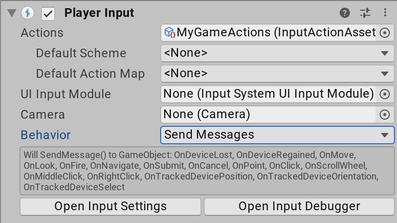
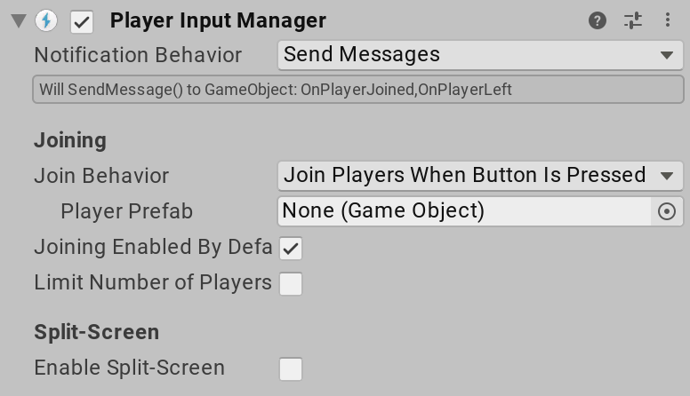

# Components

To simplify working with the new input system, the PlayerInput plugin provides a set of MonoBehaviour components and customized editors to streamline setup and handling of input in a game.

## `PlayerInput` Component

Each `PlayerInput` represents a separate player in the game. Multiple `PlayerInput` may coexist at the same time (though not on the same `GameObject`) to represent local multiplayer setups. Each player will be paired to a unique set of devices for exclusive use by the player.

### Input Actions

To receive input, each player needs an associated set of input actions.

### UI Input

The editor for `PlayerInput` components will automatically look for

>NOTE:

#### Local Multiplayer

In local multiplayer games,

#### Split-Screen

By default, any UI elements can be interacted with by any player in the game. However, in split-screen setups, it is possible to have screen-space UIs that are restricted to just one specific camera.

>NOTE: This only pertains to `Canvas` components that have `Render Mode` set to `Screen-Space Camera`. World-space UIs can be interacted with by any player. If you need to be able to tell which player initiated an interaction with a world-space UI element, use `UIInputModule.currentDevice` to get the device that triggered the current UI event and then find the player who owns the device.

## `PlayerInputManager` Component

If a game can have more than a single player, as is the case in a local co-op game for example, then some part of the game has to manage aspects like how players join the game and which devices get paired to which player. The `PlayerManager` takes care of this and can handle both single-player and multi-player setups.
